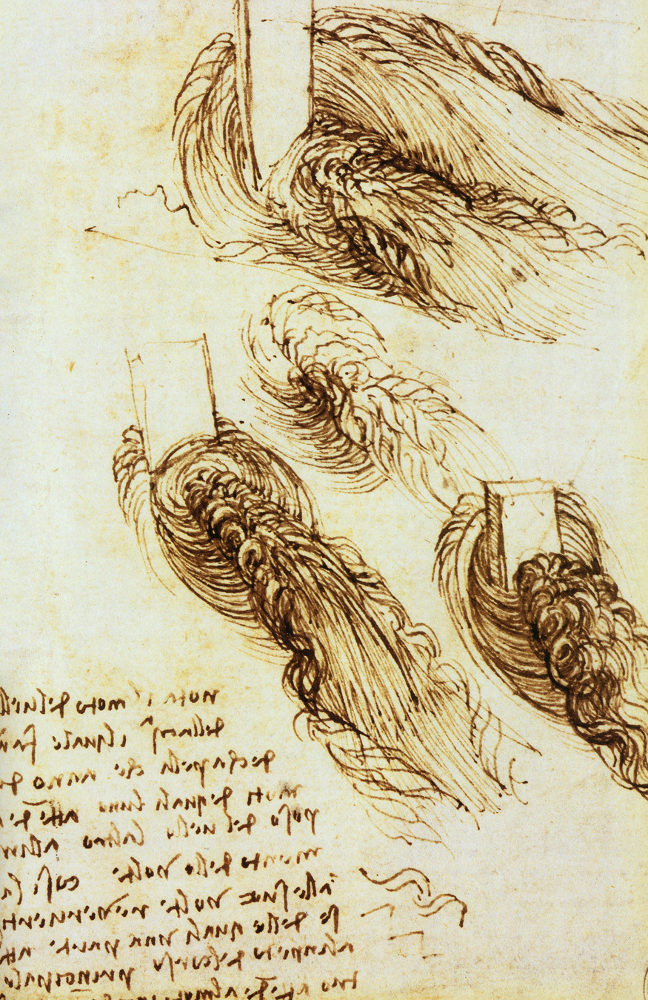
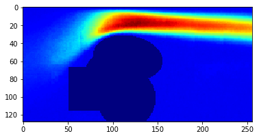

# Data-driven Steady State Flow Prediction

Use of machine learning tools to solve problems in physics (condensed matter, fluid mechanics) and chemistry (reaction prediction, drug discovery) is picking up. As far as I am aware, two professors in Canada, [Roger Melko](http://www.science.uwaterloo.ca/~rgmelko/index.html) of UWarteloo and [Alan Aspuru](http://matter.toronto.edu/machine-learning/) of UToronto, are at the forefront of this type of research.  In this, I'll be looking at an application of machine learning in the field of Fluid Mechanics by reimplementing, as best as I can, a paper titled [Convolutional Neural Networks for Steady Flow Approximation](https://autodeskresearch.com/publications/convolutional-neural-networks-steady-flow-approximation). A bit unrelated but below is Leonardo Da Vinc's sketch of streamlines!

Generating the dataset using traditional CFD methods is quite expensive, computationally and time-wise. Since the authors of the paper have not made the dataset available to the public, I had to do some things differently. In the paper, they use a dataset of containng 100,000 images; the input and output of the network are images of size 256x128 and 256x128x2 respectively. All I could manage, thanks to Oliver Hennigh, is a [dataset](https://drive.google.com/file/d/0BzsbU65NgrSuZDBMOW93OWpsMHM/view) of 3000 training images. Because of this constraint, I decided to modify the network so that it uses far fewer parameters; Insted of a netword that predicts x and y components of velocity field in the form of 256x128x2, I decided to go with a network that predicts just the magnitude of the velocity field in the form of 256x128 -- it's actually 128x256.

Traning on 2440 images and testing on 560 images (85-15 split) reults in an R2 score of 0.9. 

Prediction             |  True
:-------------------------:|:-------------------------:
  |  
 | 

